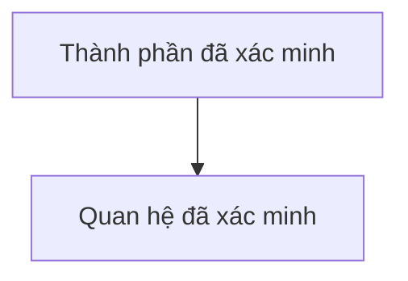

# System Diagrams

Tạo sơ đồ Mermaid từ cấu trúc và contract đã xác minh trong repository. Sơ đồ là cách nén quan hệ và luồng để giảm tải context, giúp AI và người đọc quét cấu trúc nhanh hơn. Chọn đúng loại sơ đồ theo phạm vi; không dùng sơ đồ để bù cho phần chưa khảo sát.

## Loại sơ đồ

- **Cấu trúc thư mục**: thể hiện thư mục cấp cao, module, entry point và trách nhiệm chính.
- **ERD database**: thể hiện entity/collection, PK/FK hoặc key, cardinality, index liên quan và quan hệ đã xác minh.
- **User/system flow**: thể hiện actor, entry point, validation/auth, service/module, database/external service, output và side effect.

## Quy trình

1. Đọc file nguồn liên quan: manifest, route, module, schema/model, query, API contract và tài liệu hiện có.
2. Xác định phạm vi sơ đồ và ghi nguồn căn cứ bằng path/file/dòng khi có thể.
3. Tách **Đã xác minh**, **Giả định** và **Chưa đủ dữ liệu**; không tự đặt field, quan hệ, actor hoặc service.
4. Vẽ Mermaid với nhãn ngắn, hướng đi rõ và chỉ giữ thành phần cần thiết để hiểu quan hệ.
5. Nếu không có database hoặc user/system flow trong phạm vi, ghi `Không áp dụng`. Nếu thiếu schema, ghi `Chưa đủ dữ liệu để vẽ ERD`.
6. Đối chiếu sơ đồ với file nguồn trước khi bàn giao; sửa node/edge sai hoặc bỏ phần chưa có bằng chứng.

## Khi sơ đồ giúp giảm tải

- Ưu tiên sơ đồ khi có từ 3 thành phần liên quan, nhiều bước tuần tự, hierarchy hoặc dependency/cross-module khó theo dõi bằng đoạn văn.
- Không vẽ mọi chi tiết; giữ node/edge đủ để trả lời câu hỏi của tài liệu.
- Dùng prose cho mục đích, giả định, constraint, caveat và kết luận; không chép lại toàn bộ sơ đồ thành danh sách dài.

## Mẫu đầu ra

```markdown
### Sơ đồ [cấu trúc thư mục / ERD / user flow]

**Nguồn**: `[file hoặc phạm vi đã đọc]`
**Trạng thái**: Đã xác minh / Có giả định / Chưa đủ dữ liệu


```

## Giới hạn

- Không tự thiết kế HLD/LLD mới; khi cần phương án kiến trúc, bàn giao cho `system-design-agent`.
- Không chạy migration, đổi schema/index hoặc truy cập database production để vẽ sơ đồ.
- Không kết luận ownership, cardinality, quyền hoặc flow chỉ từ tên file.
